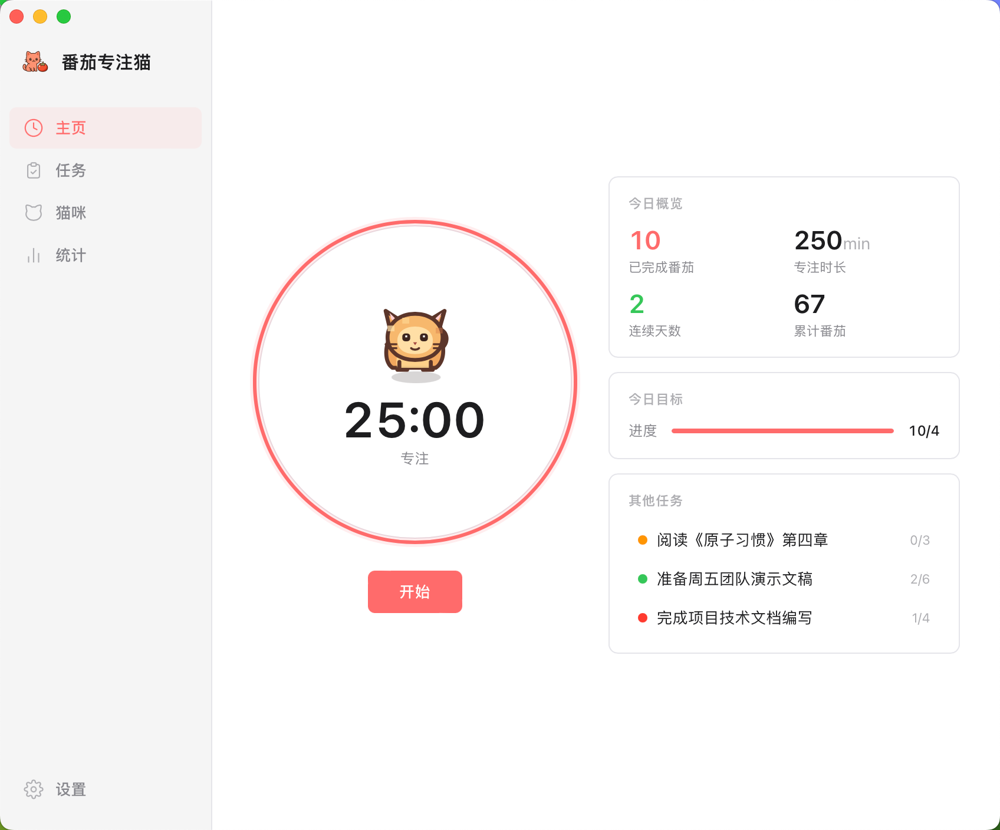
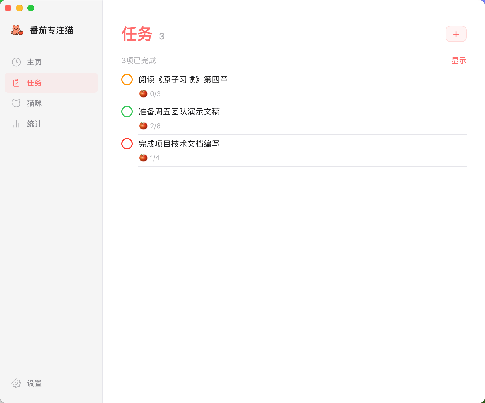
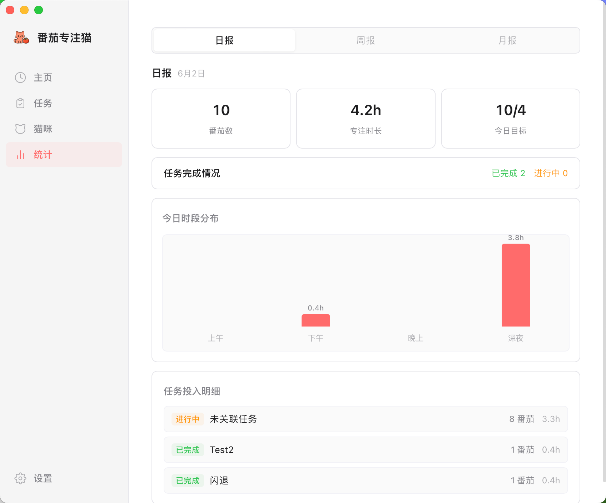

<div align="center">

  # 🐱 专注猫 (Focus Cat)

  **一款可爱的跨平台番茄钟应用，通过虚拟猫咪养成来游戏化你的生产力**

  [](https://opensource.org/licenses/MIT)
  [](https://tauri.app/)
  [](https://react.dev/)
  [](https://www.rust-lang.org/)

  [English](README_EN.md) | [中文](README.md)

</div>

---

### ✨ 特性

- ⏱️ **番茄钟计时器** - 可自定义专注和休息时长（默认 25/5 分钟）
- 🐱 **猫咪养成系统** - 完成番茄钟获得罐头，喂养猫咪，保持最佳体重
- 📝 **任务管理** - 创建和管理任务，为每个任务设置番茄目标
- 📊 **统计分析** - 可视化展示你的专注记录和统计数据
- 🎨 **简洁美观的 UI** - macOS 原生风格的现代化界面
- 🖥️ **跨平台支持** - 支持 macOS、Windows 和 Linux
- 📱 **macOS 菜单栏图标** - 方便的菜单栏快捷操作（仅 macOS）
- 🐾 **桌面宠物** - 在桌面上显示小猫咪，右键喂食，双击切换窗口
- ⌨️ **键盘快捷键** - 支持 Space 开始/暂停、Esc 放弃
- 💾 **本地数据存储** - 所有数据存储在本地 SQLite 数据库中
- 🧪 **测试模式** - 开发者可开启 1 分钟快速测试模式

### 🎯 应用截图

<div align="center">
  
  <p><em>主界面 - 番茄钟计时器（Bento 双栏布局）</em></p>

  
  <p><em>任务管理 - 为每个任务设置番茄目标</em></p>

  
  <p><em>数据统计 - 可视化你的专注记录</em></p>
</div>

### 🛠️ 技术栈

**前端**
- [React 19](https://react.dev/) - UI 框架
- [TypeScript](https://www.typescriptlang.org/) - 类型安全
- [Tailwind CSS v4](https://tailwindcss.com/) - 样式框架
- [Zustand](https://github.com/pmndrs/zustand) - 状态管理
- [React Router](https://reactrouter.com/) - 路由管理

**后端**
- [Tauri 2](https://tauri.app/) - 跨平台桌面应用框架
- [Rust](https://www.rust-lang.org/) - 系统编程语言
- [SQLite](https://www.sqlite.org/) - 嵌入式数据库（via rusqlite）

### 📦 安装

#### 从预构建版本安装（推荐）

1. 前往 [Releases](https://github.com/junoohoome/focus-cat/releases) 页面
2. 下载适合你操作系统的安装包
3. 安装并运行应用

#### 从源码构建

**前置要求**

- Node.js 18+
- Rust 1.70+ 和 Cargo
- 系统依赖（根据操作系统）

**macOS**
```bash
# 安装 Rust
curl --proto '=https' --tlsv1.2 -sSf https://sh.rustup.rs | sh

# 克隆项目
git clone https://github.com/junoohoome/focus-cat.git
cd focus-cat

# 安装依赖
npm install

# 运行开发模式
npm run tauri dev

# 构建生产版本
npm run tauri build
```

**Windows**
```bash
# 安装 Rust: https://www.rust-lang.org/tools/install

# 克隆项目
git clone https://github.com/junoohoome/focus-cat.git
cd focus-cat

# 安装依赖
npm install

# 运行开发模式
npm run tauri dev

# 构建生产版本
npm run tauri build
```

**Linux**
```bash
# 安装 Rust
curl --proto '=https' --tlsv1.2 -sSf https://sh.rustup.rs | sh

# 安装系统依赖（Ubuntu/Debian）
sudo apt update
sudo apt install libwebkit2gtk-4.1-dev \
  build-essential \
  curl \
  wget \
  file \
  libxdo-dev \
  libssl-dev \
  libayatana-appindicator3-dev \
  librsvg2-dev

# 克隆项目
git clone https://github.com/junoohoome/focus-cat.git
cd focus-cat

# 安装依赖
npm install

# 运行开发模式
npm run tauri dev

# 构建生产版本
npm run tauri build
```

### 🚀 使用指南

1. **开始番茄钟** - 点击主页的"开始"按钮，或按 `Space` 键
2. **管理任务** - 在"任务"页面创建待办事项，设置番茄目标
3. **查看猫咪** - 在"猫咪"页面喂养猫咪，保持最佳体重（4-6kg）
4. **统计数据** - 在"统计"页面查看专注记录和图表
5. **调整设置** - 在"设置"页面自定义专注/休息时长、主题等

### 🐾 桌面宠物交互

| 操作 | 功能 |
|------|------|
| 双击宠物 | 显示 / 最小化主窗口 |
| 右键宠物 | 打开喂食菜单 |
| 拖拽宠物 | 移动宠物位置 |

### ⌨️ 快捷键

| 快捷键 | 功能 |
|--------|------|
| `Space` | 开始 / 暂停 |
| `Esc` | 放弃当前番茄钟 |

### 🧪 测试模式

开发过程中可以开启测试模式，将专注和休息时间缩短为 1 分钟：

1. 进入"设置"页面
2. 启用"测试模式"开关（仅开发环境可见）
3. 完成番茄钟后，记录的时间仍为标准的 25 分钟

⚠️ 注意：测试模式仅供开发使用，不会影响实际统计数据的准确性。

### 🤝 贡献指南

我们欢迎任何形式的贡献！

1. Fork 本项目
2. 创建你的特性分支 (`git checkout -b feature/AmazingFeature`)
3. 提交你的更改 (`git commit -m 'Add some AmazingFeature'`)
4. 推送到分支 (`git push origin feature/AmazingFeature`)
5. 开启一个 Pull Request

### 📄 许可证

本项目采用 MIT 许可证 - 详见 [LICENSE](LICENSE) 文件

---

<div align="center">

**如果这个项目对你有帮助，请给个 ⭐️ Star！**

</div>
